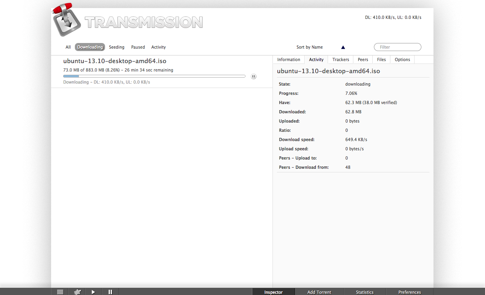
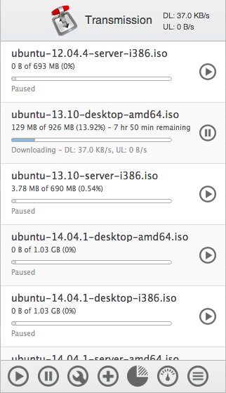

# kettu
Port of http://github.com/kjg/derailleur and the original Transmission Web Client
using [jquery](http://jquery.com), [sammy.js](http://github.com/quirkey/sammy) and [mustache.js](http://github.com/janl/mustache.js).

## Thanks
* kriesse for the elegant design.
* kjg for all the work on the transmission web client and help.
* lenalena for introducing proper jspec testing to this project.
* kastigar for adding predefined locations.
* viveksjain and Shadow6363 for keyboard shortcuts and how numbers are displayed.

## Screenshots
### Desktop

### Mobile

## Installation
You can use kettu instead of the original web client to remotely administrate your transmission application.

### Using Environment Variables
If you're just trying kettu out, it is recommended to set the TRANSMISSION_WEB_HOME environment variable to the root path of this web client. Then you just need to open the location to the transmission web server (e.g. localhost:9091) and it will work.

### Manual Installation
Move the kettu files in the right location, and the next time you start Transmission, it will use kettu. If you're using the daemon, you can simply send it a `SIGHUB`.

#### Linux
Without overwriting the default Web Interface, you can drop the kettu files into: `~/.local/share/transmission/web/`.

#### On Mac OS X
In the pre-v2.0 nightlies on the mac, you can simply drop kettu at `~/Library/Application Support/Transmission/web/`. In more current versions the web interface is located at `/Applications/Transmission.app/Contents/Resources/web/` and would need to be replaced there.

## Configuration
kettu supports the easy selection of a predefined location to download your torrents to. Put locations into the  `config/location.js` configuration file. See `config/locations.js.example` for an example.

## Shortcuts
You can drag to select multiple torrents. kettu also has a few hotkeys:

 - `Cmd/Ctrl+A` - select all
 - `Cmd/Ctrl+Backspace` - delete the selected torrents
 - `Cmd/Ctrl+Alt+Backspace` - delete finished torrents. A torrent is defined as finished if it has finished downloading and is paused.
